# Prop-Chromeleon Dataset (Picture & Video)


## Read First
This dataset is produced by the "Prop-Chromeleon" system and includes images, videos, and an HTML file for conducting binary tests and collecting results.
The dataset includes two comparison groups: 000-049 and 050-100. 
Both use the same 50 base models as prop, randomly selected from each category in ShapeNet (https://shapenet.org/) to ensure a diverse range of shapes.
The groups differ in their prompts: the first group uses eight consistent prompts across all models, whereas the second group has customized prompts tailored to each model’s specific shape. ticipants will evaluate the system's effectiveness by assessing each group's success or failure.

Participants will evaluate the system's effectiveness by assessing each group's success or failure.
The evaluation time may vary, typically around 90 minutes, depending on the speed of judgment.


## Instructions
The evaluation platform is hosted on a local HTML server to enhance stability. 
Each page displays the prompt, the original image, and the video result. 
Participants should judge the results based on the following criteria:  
**Criteria**: 
- **Is the element from the prompt recognizable in the result?**
- **Does the result align with the adjectives in the prompt?**
- **Does the result match with the overall prompt?**

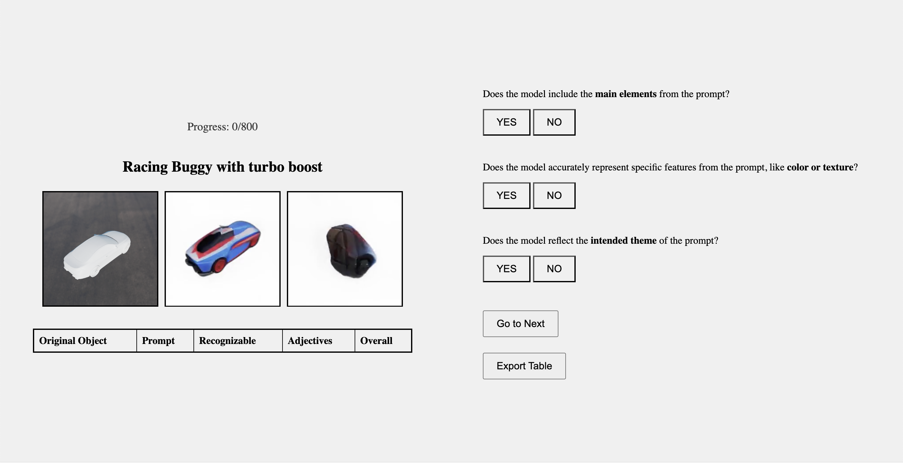

## Launch
First, clone this dataset to your local (Cloning this repository requires 900MB of space.)
   ```bash
   git clone https://github.com/harrywang7121/BinaryTestDataset
   cd BinaryTestDataset
   ```
then start a local web server:
   ```bash
   python -m http.server  
   ```
Now the test will be running at: http://localhost:8000/index.html


## Instructions
- Your progress is saved in real-time, you can manually export current results as csv file at any point.  
- But please be aware that the 800 groups are displayed in a random order each visit, so the sequence may change if you leave and return to the website.   
- We choose local server for stability, but it's important to allocate enough time to complete the session in one sitting (approximately 90 minutes).   
- A pop-up reminder will help prevent accidental exit, and your progress will automatically save once you finish all 800 groups.   
- The page will remain active even after reaching 800 evaluations or manual saving.  
- You can use keyboard shortcuts 'S' for success and 'F' for failure.

## Calibration
For calibration, we give three typical groups for each success/fail: 

**Failure**:
1. Prompt: A red mushroom    
  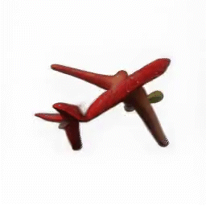  

2. Prompt: A talking cactus with a sombrero  
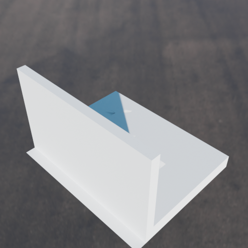  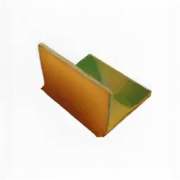

3. Prompt: Dragon  
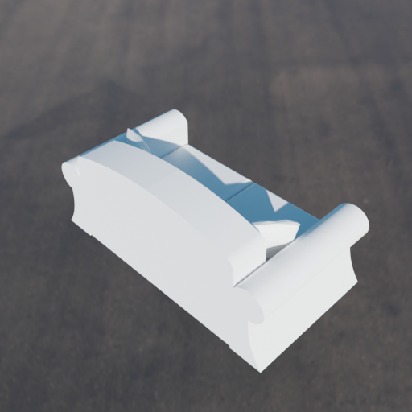  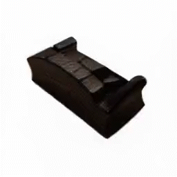


**Success**:
1. Prompt: Spaceship  
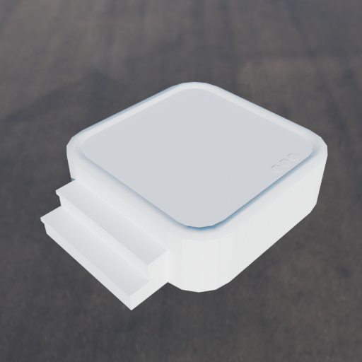  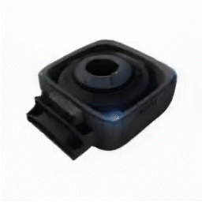

2. Prompt: Pink jar with woven texture  
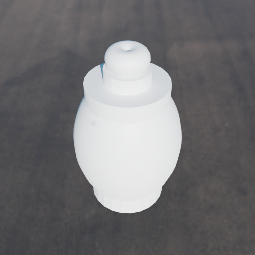  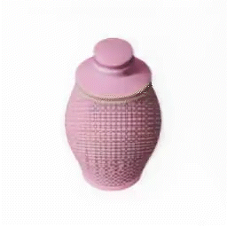

3. Prompt: Smart Home Central Hub  
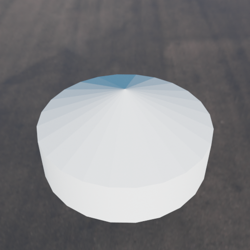  